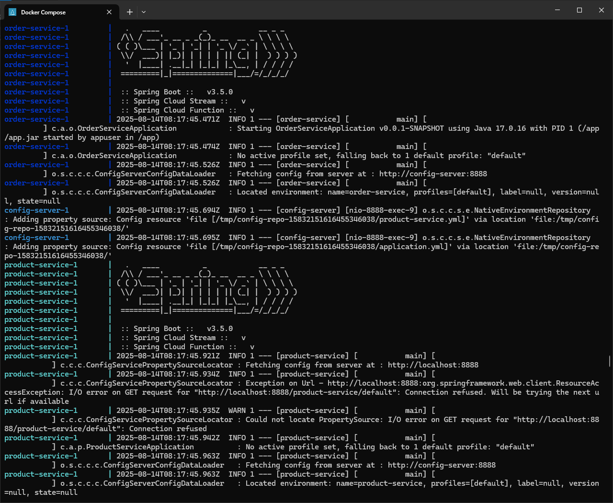
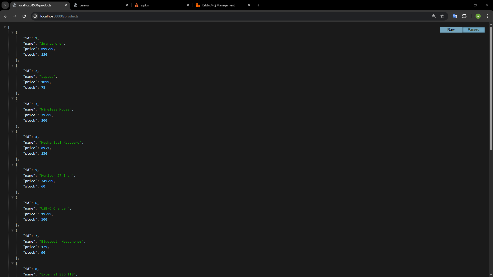
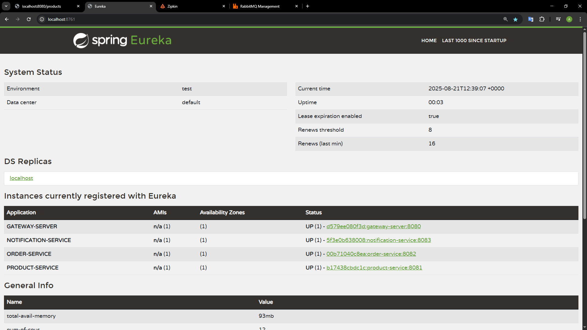
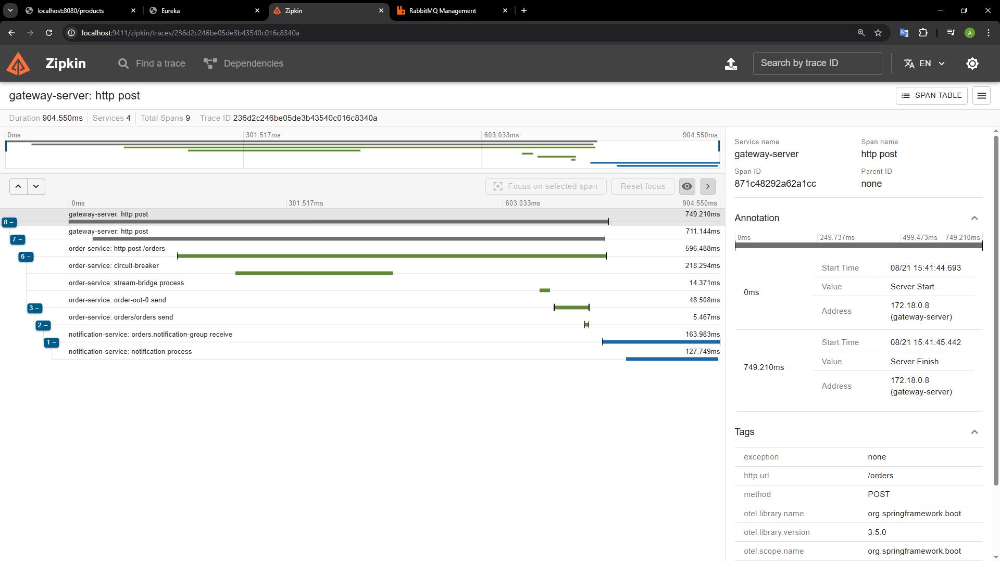
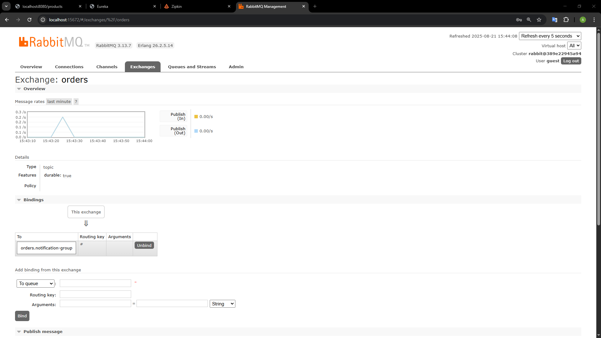
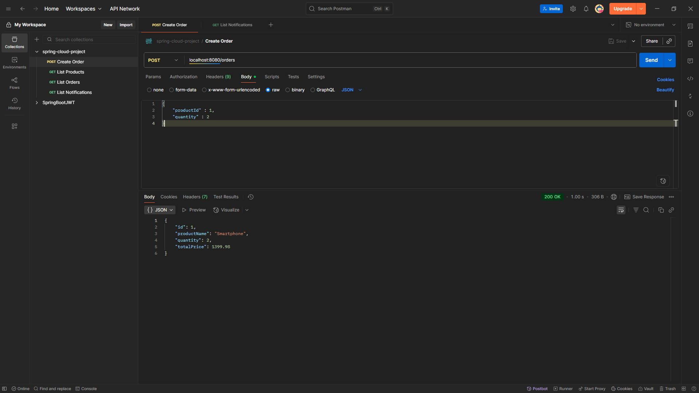
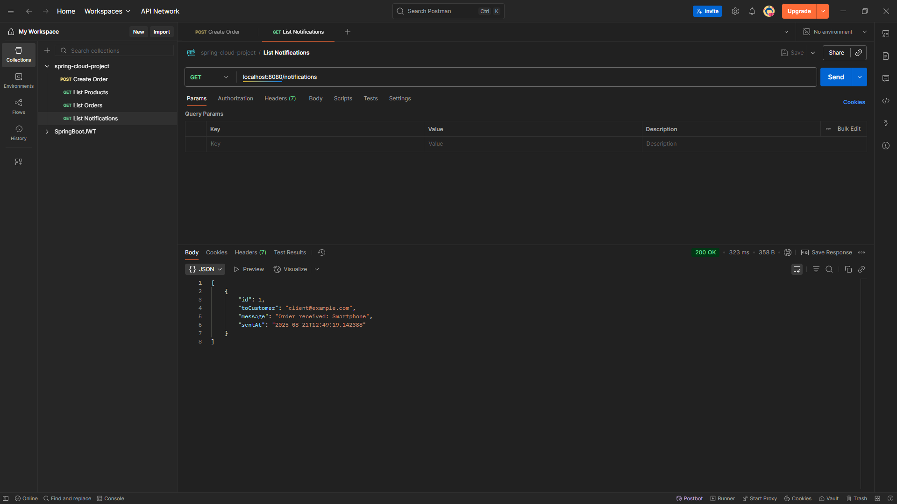

# Spring Cloud Project

## 📌 Overview
This project demonstrates a **microservices architecture** built with **Spring Boot** and **Spring Cloud**.  
It integrates service discovery, centralized configuration, API Gateway, asynchronous communication, resilience patterns, monitoring, and secure secret management.

 
 
 
 
 
  

 
 
 
 
 


---

## 🏗 Architecture Highlights
- **Centralized Configuration** via Spring Cloud Config
- **Service Discovery** with Eureka
- **API Gateway** with Redis rate limiting & Circuit Breakers
- **Resilient Communication** with Resilience4j
- **Asynchronous Messaging** with Spring Cloud Stream (RabbitMQ / Kafka-ready)
- **Distributed Tracing** with Zipkin
- **Metrics Exposure** with Spring Boot Actuator
- **Secure Secrets** with HashiCorp Vault
- **Optimized Docker Images** following multi-stage build best practices
- **Spring Cloud Bus** for real-time propagation of configuration changes

---

## 📂 Microservices Overview

| Microservice           | Functionality |
|------------------------|--------------------|
| **gateway-server**     | Routes incoming requests to microservices. Integrated with Redis for rate limiting and Circuit Breakers (Resilience4j) to handle failures. Exposes metrics via **Spring Boot Actuator** and is connected to **Zipkin** for distributed tracing. |
| **product-service**    | Stores product information. Exposes Actuator metrics and sends tracing data to Zipkin. |
| **order-service**      | Calls `product-service` via Feign to register orders and check stock. Integrated with Circuit Breaker (Resilience4j) for resilience. After processing, publishes messages via RabbitMQ to `notification-service`. Uses Spring Cloud Stream for broker flexibility. Exposes Actuator metrics and sends tracing data to Zipkin. |
| **notification-service** | Saves notifications in the database and logs them. Can be extended with email/SMS. Connected to RabbitMQ via Spring Cloud Stream. Exposes Actuator metrics and sends tracing data to Zipkin. |
| **config-server**      | Retrieves configs from GitHub and distributes them to services. Connects to Vault for secrets management. |
| **discovery-server**   | Eureka service avoiding hardcoded URLs and distributing requests between instances via Spring Cloud LoadBalancer. |

All microservices are integrated with **Spring Cloud Bus** to automatically propagate configuration changes to all instances via RabbitMQ, ensuring real-time updates without restarts.

---

## 📊 Monitoring & Observability
- **Actuator Metrics**: Exposed by `gateway-server`, `product-service`, `order-service`, and `notification-service` at `/actuator/*`.
- **Zipkin Integration**: Traces requests across multiple services for debugging and performance optimization.
- **Spring Cloud Sleuth**: Automatically propagates trace and span IDs across microservices.

---

## 🐳 Docker Compose Setup
The project includes a **`docker-compose.yml`** file to orchestrate all services.  
Running `docker-compose up` starts:

- **config-server**
- **discovery-server** (Eureka)
- **gateway-server**
- **product-service**
- **order-service**
- **notification-service**
- **RabbitMQ** (with management console)
- **Redis** (for rate limiting)
- **Zipkin** (for distributed tracing)
- **Vault** (for secrets)

This setup ensures:
- Networking between services
- Correct startup order
- Easy local development without manual container management

---

## ⚙️ Environment Configuration (`.env`)
The `.env` file contains environment variables used by `docker-compose.yml`:

- **Service Ports** (e.g., `GATEWAY_PORT=8080`)
- **Image Tags** (e.g., `JAVA_IMAGE_TAG=17-jre-alpine`)
- **Credentials & URLs** (RabbitMQ, Vault, etc.)

This allows for quick configuration changes without editing multiple files — just update `.env` and restart.

---

## 📜 Utility Scripts (`/scripts`)

| Script | Description |
|--------|-------------|
| **`build-and-push.sh`** | Builds all microservice Docker images locally and pushes them to a registry. Uses multi-stage builds for optimized size and security. |
| **`wait-for-config.sh`** | Waits for `config-server` to be ready before starting dependent services, preventing startup errors. |
| **`vault-init.sh`** | Initializes and unseals HashiCorp Vault, then configures default secrets (e.g., RabbitMQ credentials, DB users). Automates secret management setup for local development. |

These scripts improve automation in local development and CI/CD pipelines.

---

## 🛠 Tech Stack

- **Java 17+**, Maven
- **Spring Boot**, **Spring Cloud**
- **Eureka**, **Config Server**, **Gateway**
- **Resilience4j**, **Redis**, **RabbitMQ**
- **Spring Cloud Stream**
- **Zipkin**, **Actuator**, **Sleuth**
- **Vault**
- **Docker**, **Docker Compose**

---

## 📦 Docker Build Best Practices
All services use a **multi-stage Docker build** for optimal image size and security:

```dockerfile
# BUILD STAGE
FROM maven:3.9-eclipse-temurin-17 AS builder
WORKDIR /app
COPY pom.xml .
COPY mvnw .
COPY .mvn/ .mvn/
RUN ./mvnw dependency:go-offline
COPY src ./src
RUN ./mvnw clean package -DskipTests

# RUNTIME STAGE
FROM eclipse-temurin:17-jre-alpine
WORKDIR /app
RUN addgroup -S appgroup && adduser -S appuser -G appgroup
COPY --chown=appuser:appgroup --from=builder /app/target/*.jar app.jar
USER appuser
EXPOSE 8081
ENTRYPOINT ["java", "-jar", "app.jar"]
```

**Applied best practices:**

- Multi-stage builds reduce final image size  
- Non-root user for security  
- Dependency caching for faster builds  
- Layer optimization for rebuild speed  
- Minimal base image (`alpine`) for reduced attack surface  

---

## 🚀 Running the Project

# Clone repository
git clone https://github.com/AlexandruAlexa1/spring-cloud-ecommerce.git
cd spring-cloud-ecommerce

# Start services
docker-compose up --build

## Access endpoints:

Gateway: http://localhost:8080

Eureka: http://localhost:8761

Zipkin: http://localhost:9411

Product Service: http://localhost:8081/products

Order Service: http://localhost:8082/orders

Notification: http://localhost:8083/notifications

## Docker Compose



## List Products



## Eureka



## Zipkin



## RabbitMQ



## Create Order



## List Notifications

